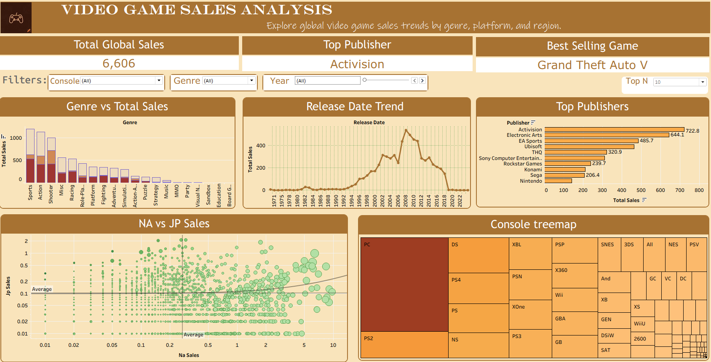

# 🎮 Video Game Sales Analysis — Tableau Dashboard

An interactive Tableau dashboard analyzing global video game sales trends across genres, platforms, publishers, and regions using real-world data from VGChartz.

---

## 📊 Dashboard Preview

---

## 📁 Dataset

| Detail | Info |
|--------|------|
| Source | VGChartz 2024 |
| File | vgchartz-2024.xlsx |
| Total Games | ~60,000 titles |
| Columns | Title, Console, Genre, Publisher, Developer, Critic Score, Total Sales, NA Sales, JP Sales, PAL Sales, Other Sales, Release Date |

---

## 🗂️ Dashboard Sheets

| Sheet | Chart Type | Description |
|-------|-----------|-------------|
| Genre vs Total Sales | Bar Chart | Compares total sales across all game genres |
| Console Treemap | Treemap | Visual breakdown of games per platform |
| Regional Sales by Genre | Grouped Bar | Compares NA, PAL, JP sales side by side |
| Top Publishers | Horizontal Bar | Dynamic Top N filter (5 / 10 / 15) |
| Release Date Trend | Line Chart | Sales trend over time by year |
| NA vs JP Sales | Scatter Plot | Game-level regional comparison with size = Total Sales |
| KPI — Total Global Sales | KPI Card | Grand total sales across all titles |
| KPI — Top Genre | KPI Card | Highest selling genre globally |
| KPI — Best Selling Game | KPI Card | Single best selling title in dataset |

---

## ✨ Interactive Features

- **Genre filter** — filters all charts simultaneously
- **Console filter** — drill down by platform
- **Year range slider** — explore any time window
- **Top N parameter** — switch between Top 5 / 10 / 15 publishers live
- **Click-to-filter actions** — clicking any bar or treemap cell updates all charts
- **Highlight action** — hovering dims unrelated data marks
- **Custom tooltips** — hover any data point to see game name, publisher, regional sales, and JP vs NA ratio

---

## 🔍 Key Insights

- **PC leads all platforms** with 12,572 titles — the most game releases of any console
- **Sports is the top genre** by global sales volume
- **NA dominates every genre** — North America is consistently the largest market across all categories
- **Activision is the #1 publisher** with 722.8M total sales across all titles
- **Gaming peaked between 2007–2011**, with 2008 recording the highest number of game releases
- **Japan vs NA split is extreme** — Hot Shots Golf has a JP/NA ratio of 8.19 (Japan dominated), while Call of Duty: Black Ops has a ratio of 0.01 (NA dominated)

---

## 🧮 Calculated Fields

| Field | Formula | Purpose |
|-------|---------|---------|
| JP vs NA Ratio | `[jp_sales] / [na_sales]` | Identifies Japan-dominant vs NA-dominant titles |
| Sales Category | `IF [total_sales] > 5 THEN "Blockbuster" ELSEIF [total_sales] > 1 THEN "Hit" ELSE "Average" END` | Segments games by commercial performance |
| Regional Total | `[na_sales] + [pal_sales] + [jp_sales] + [other_sales]` | Used to verify data completeness against Total Sales |

> **Note:** Regional sales data is partially available across titles. Total Sales is used as the primary metric throughout the dashboard.

---

## 🛠️ Tools Used

- **Tableau Desktop 2026.1**
- **Microsoft Excel** (data source)

---

## 🚀 How to Open

1. Download `Video Game sales.twb`
2. Open in Tableau Desktop (2020.1 or later)
3. Data is embedded — no reconnection needed

---

## 👤 Author

**Ujjwal**
- GitHub: [github.com/ujjwalrajput31](https://github.com/ujjwalrajput31)
- LinkedIn: [linkedin.com/in/ujjwal-ds-ai](https://linkedin.com/in/ujjwal-ds-ai)
- Portfolio: [ujjwalrajput.netlify.app](https://ujjwalrajput.netlify.app)
